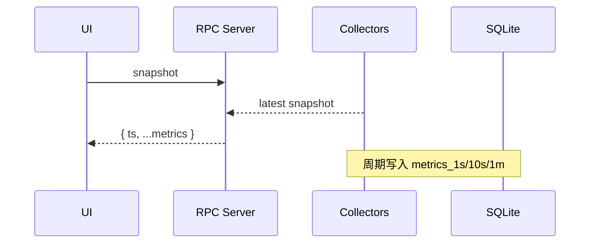
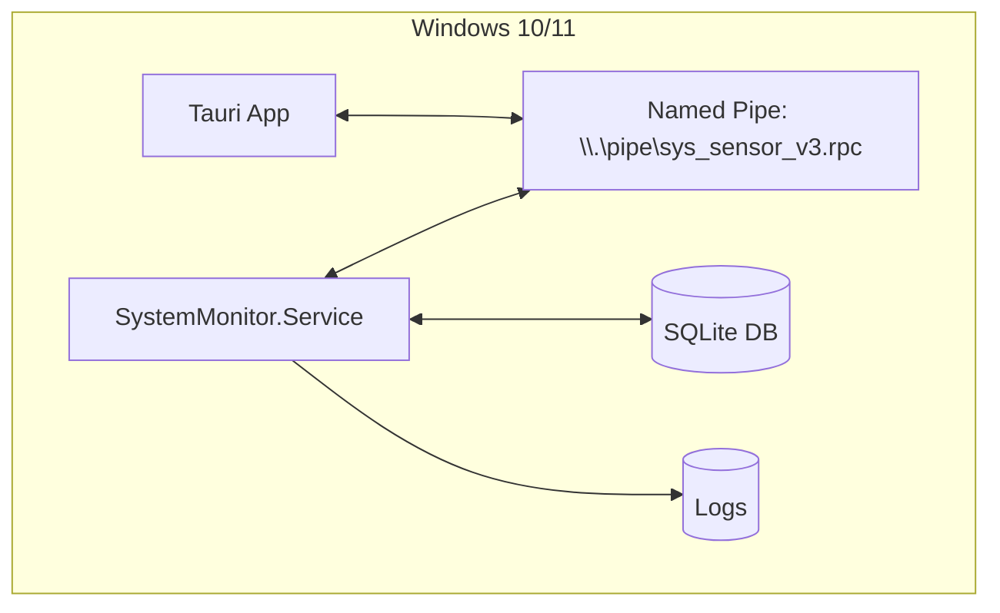
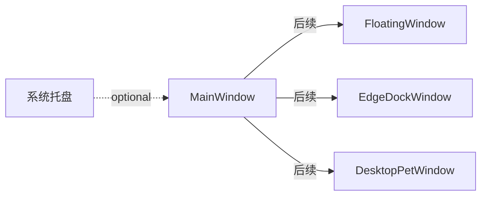

# 系统架构设计（v1 草案）

> 本文档根据 `doc/task.md` 要求，提供组件关系、数据流向、部署架构、窗口系统关系的初版定义，用于契约冻结前评审。

## 1. 组件关系图（ASCII）
```
[UI: Tauri(Vue3/TS)] --JsonRpc--> [Named Pipe 客户端(Rust插件)] --HeaderDelimited--> 
[Named Pipe 传输 \\.\pipe\sys_sensor_v3.rpc] --> [C# 服务(StreamJsonRpc 服务端)]
   |                                                                 |
   |<-- events(metrics/state/alert/update_ready/ping)  <-------------|
```

### 1.1 组件关系（Mermaid 占位）
```mermaid
flowchart LR
  UI[Vue3/Tauri App] -- JSON-RPC --> PipeClient[Rust Pipe Client]
  PipeClient -- HeaderDelimited --> Pipe[\\.\\pipe\\sys_sensor_v3.rpc]
  Pipe --> RpcServer[StreamJsonRpc Server]
  RpcServer --> MetricsSvc[MetricsCollectionService]
  RpcServer --> Storage[SqliteStore/Aggregator]
  RpcServer --> Updater[UpdateService]
  RpcServer --> Rules[AlertRulesEngine]
  RpcServer --> Power[PowerManagementService]
  RpcServer <-- events --- UI
```

## 2. 数据流向
- __采集__: `Collectors/*` 周期采集 → `MetricsCollectionService` 聚合 → 内存快照/RingBuffer → 事件推送/SQLite 落盘（已启用）
- __查询__: UI `snapshot/query_history` → RPC → 服务优先读取 SQLite（命中）/内存缓存（回退）/即时快照（兜底） → 响应
- __配置__: UI `set_config` → 服务生效（支持热重载）

### 2.1 数据流向（Mermaid 占位）


## 3. 部署架构
- __进程__：
  - `SystemMonitor.Service`（控制台/Windows服务二选一形态）
  - `frontend`（Tauri 桌面应用）
- __文件路径__：参考 `doc/task.md` 的“数据管理方案/文件位置”（SQLite DB 按平台标准应用数据目录存放）
- __权限/安全__：Named Pipe 严格 ACL；Token 认证

### 3.1 部署（Mermaid 占位）


## 4. 窗口系统关系（MVP范围）
- 单窗口（Debug/主窗口复用）
- 后续（两窗法/托盘/宠物）在对应里程碑前再冻结

### 4.1 窗口关系（Mermaid 占位）


## 5. 时序（握手/订阅示意）
1) UI 启动 → `hello`
2) 服务返回 `server_version/protocol_version`
3) UI 可 `start` / `burst_subscribe` / 轮询 `snapshot`

### 5.1 前端 RPC/事件桥策略
- __事件桥__: `frontend/src/api/rpc.tauri.ts` 的 `ensureEventBridge()` 通过 `@tauri-apps/api/core.invoke('start_event_bridge')` 启动事件桥；若尚未就绪，每 3s 重试，直到收到 `metrics`。
- __来源探测__: 运行时通过 `window.__IS_TAURI__` 判断宿主，动态选择 `tauriRpc` / `mockRpc`（见 `frontend/src/api/rpc.ts`）。
- __超时/加载__: 统一为 RPC 设置 6s 超时；局部 loading 最长展示 800ms，避免阻塞感（见 `ControlPanel.vue`、`HistoryQuery.vue`、`HistoryChart.vue`）。

### 5.2 历史查询与可视化
- `HistoryQuery.vue`：支持快捷时间窗（近 1/5/15 分钟）和“到现在”开关（`to_ts=0`）。
- `HistoryChart.vue`：展示 CPU% 与 Memory% 双曲线，支持自动刷新（默认 5s）。

## 6. 非功能性要求绑定
- 启动、内存、CPU、帧率、长稳等参见 `doc/task.md` NFR

## 7. 待确认
- UI 运行在便携化场景下的数据路径策略
 - 多窗口间状态同步与资源占用上限
 - 调试模式下的诊断端口是否需要（默认不开端口）
