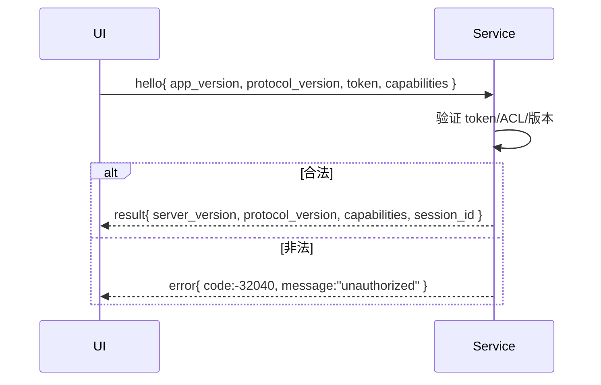

# 安全设计（M1 骨架）

## 1. 威胁模型与攻击面
- 本地 IPC（Named Pipe）劫持与权限提升
- 配置/日志/数据库中的敏感信息泄露
- 组件更新与执行完整性

## 2. Named Pipe ACL 与最小权限
- 管道名：`\\.\pipe\sys_sensor_v3.rpc`
- ACL 建议：`LocalSystem`、本机 `Administrators`、当前交互用户 SID
- 拒绝 `ANONYMOUS LOGON`、`Everyone`
- 服务启动时记录有效 ACL 到日志，异常立即失败

## 3. 握手与认证
- `hello` 必带 `token`（本地生成/安装时下发）
- 返回 `protocol_version`、`capabilities`，客户端做兼容分支
- 失败返回 JSON-RPC `unauthorized(-32040)`

### 3.1 Token 生成与存储
- 生成：安装阶段生成 128-bit 随机数，Base64Url 编码
- 存放：`%ProgramData%\sys-sensor-v3\token`，ACL 仅 SYSTEM/Administrators/当前用户（600 权限）
- 轮换：提供 `update_token` 运维脚本，轮换后要求客户端重新 `hello`

### 3.2 握手时序（Mermaid 占位）

## 4. 能力与授权
- 按能力位开放接口（如 `history_query`）
- 未来可按会话粒度限流/配额

## 5. 日志与隐私
- 统一结构化日志（禁止记录 token/PII）
- 滚动与保留：容量/天数双阈值
- 故障时仅打印摘要与哈希，避免原始载荷落盘

## 6. 更新与完整性（预研）
- 包签名与验签、回滚策略、受限更新通道
- 最小化执行权限（非管理员运行）

### 6.1 签名验证流程（占位）
1) 发行时使用代码签名证书对更新包签名
2) 客户端仅信任内置公钥/证书链，离线验证签名
3) 校验哈希/长度后进行原子替换，失败回滚
4) 升级过程产生最小停机时间（目标 <5s）

## 7. 安全基线
- 默认最小权限运行
- 对外接口最小集、参数严格校验（`invalid_params`）
- 单元与 E2E 含安全用例（认证失败、ACL 异常、权限不足）

### 7.1 最小权限清单（初版）
- 服务进程：本地系统服务或普通用户（优先普通用户），仅访问 ProgramData 对应目录
- 管道：仅 SYSTEM/Administrators/当前交互用户可读写
- 文件：`token` 600、`data.db` 660、`logs` 可写、禁止 Everyone/Anonymous
- 网络：默认不开放任何端口；调试端口需文档声明并默认关闭
