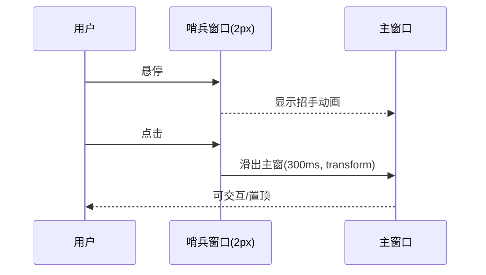

# 窗口系统设计（MVP/两窗法草案）

## 1. 窗口清单
- __MainWindow__：调试/主展示（MVP 仅此）
- __FloatingWindow__：悬浮窗口（后续）
- __EdgeDockWindow__：贴边两窗法哨兵/主窗（后续）
- __DesktopPetWindow__：宠物（后续）

## 2. 创建参数要点（Tauri）
- 置顶、透明、点击穿透可切换
- 多显示器坐标系/记忆
- 初始尺寸/位置：按 DPI 缩放，跨屏边界对齐
- 窗口标识：`label` 固定，便于多窗口管理
- 安全：禁用 remote URL；资源走本地 `asset:` 协议

## 3. 两窗法细节（预案）
- 哨兵窗口 2px 把手 → 悬停招手 → 点击滑出主窗
- 动画采用 CSS transform，GPU 加速

### 3.1 两窗法时序（Mermaid 占位）

## 4. 动画策略与触发
- 60fps（电池模式 30fps）
- 触发：指标阈值/交互/时间条件

## 5. 点击穿透切换
- 需求：在展示与交互间切换；提供快捷键与 UI 切换
- 方案：Tauri 插件控制 `set_ignore_cursor_events(true/false)`（后续实现）
- 快捷键建议：`Ctrl+Alt+P`（占位）
